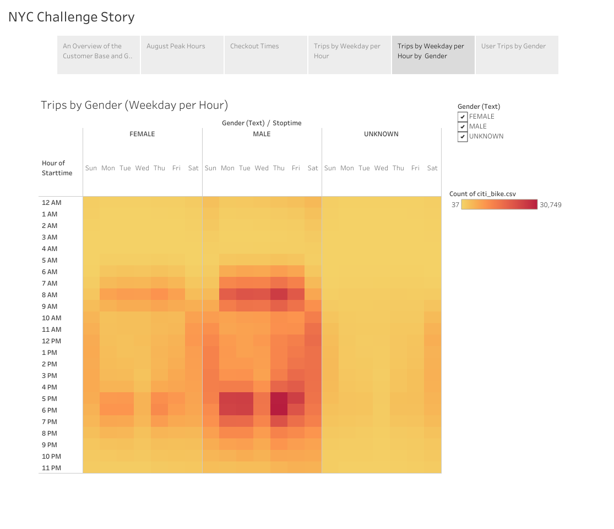

# Bike Sharing

## Dashboard Link: (https://public.tableau.com/app/profile/mobin.piracha/viz/NYCChallenge/NYCChallengeStory)
## Overview 
In this analysis, we look at the feasibility of opening up a bikesharing business in Des Moines, Iowa. In order to present this idea to an Angel Investor for seed funding, we need to understand how the bike sharing businesses work in other cities such as New York City where CitiBike operates, from where we can understand how such a business can work in Des Moines. Therefore, we will explore the New York CitiBike data to look for insights in understanding how to make a bikesharing business a success in Des Moines. 

## Results 

### Customer Base

There are over 2,344,224 Trips in the month of August. We find that 81% of Total Customer base are Subscribers and 65% of Customers are Men. This indicates that a significant portion of the customer base in New York City is Male. With 81% of Total Customers are Subscribers it means that despite heavy tourism in New York City, majority of the bike revenues come from residents of New York. 

### Peak Hours in August

August is a time when weather in the Northeast United States is ideal for outdoor activities. Therefore, we can expect a large portion of bike trips and thus bike revenues to come in summer months when the weather is ideal for cycling. Des Moines has similar weather to New York City. From sources, we know that New York City has 224 sunny days per year while Des Moines has 204. Therefore, there are similarities in climate in both cities. We look at peak hours for the month of August are 7AM-9AM and 5PM-7PM, hours where people commute to and back from work. Therefore, this bar graph suggests that majority of the customers are residents of New York who use the New York Citibike to commute to and from work. Therefore, when setting up such a business in Des Moines, it will be important to focus on working people who could use the bike service to commute. Having a reliable customer base of subscribers who use bikes to commute will work better in Des Moines, which is not as touristy as New York City. 

### Bike Checkout Duration

Almost all bike trips have a duration of below 40 minutes with a large chunk of trips around 10 minutes with trends remaining the same by Gender. We know that majority of the subscribers are commuters. This means setting up bike stations in the downtown area, where most businesses and offices are will work best in Des Moines. The bikes will be convenient form of transportation for residents of Des Moines who live in downtown, and want to take a short bike ride to their offices, that are located between 10 to 25 minutes away. Ensuring that bike stations are nearby both residential and commercial areas to ensure easy access. 

### Bike Trips by Weekday

Trips by Weekday per hour show majority of trips happening during the peak hours of 7AM-9AM and 5PM-7PM from Monday to Friday, while Saturday biketrips occur mid-morning and afternoon time, as most people don't work on Saturday. This would suggest that majority of bike usage will be during the week during commuter hours of early morning or just at the end of the working day. Maintainence would be best around 2AM to 4AM when usage is low. 

### Bike Trips for each Gender by Weekday

Visualizing Trips by Weekday per hour based on Gender show that most trips are taken by Men, which a large part of the customer base, mainly during commuter hours. Female and Unknown categories also take trips during similar hours but account for a smaller proportion of total trips. This visualization further reinforces that Men are more likely to use CitiBike, therefore, in a marketing standpoint, targeting working males would most likely increase customer base and revenues. 

### User Trips for each Gender by Weekday

User Trip by Gender shows us that majority of trips are taken by Male Subscribers and some Female Subscribers while non-subscribing Customers account for a very small portion of user trips. We notice that subscribers, Male and even some female fequently make trips, on both weekdays and weekends, indicating that bicyles are an important short distance mode of transportation. Bicycles are used for both commuting to work but, sometimes, also for leisure, especially by subscribers. 

## Summary 
After analyzing all the visuals, we come to the conclusion that there is a feasibility of starting a bikesharing venture in Des Moines, Iowa. From the New York data, we find that majority of the cycling will take place during summer months, when the weather is sunny. Most of the targeted age group is working individuals, predominantly males, who live in downtown, near their offices, and are comfortable with a 15-25 minute bike ride. Bike stations need to be placed in the downtown area near residential buildings and offices so bicycles are accessible. Annual plans should be marketed at a discounted rate to encourage a subscription based models, as we see that in New York 80% of the customers are subscribers. In Des Moines, there should be even more emphasis on a subscription based model due to lack of tourism in the area. 

I would also recommend a few more visualizations that could help us understand the customer base and can give some information on a marketing strategy. Finding some demographic information on Des Moines, we could visualize the gender and age group breakdown of Des Moines in a stacked bar chart. This will allow us to see the percentage of young people living in Des Moines as well as their gender, as we know that people from a younger age group and males are more likely to use bicycles. Also creating a population density map of Downtown, Des Moines will also help understand where most of the population lives and where bike stations could be potentially set up. After thoroughly visualizing data in New York City, its important to find some public city data on Des Moines and create some visuals to see whether starting a bike sharing venture in Des Moines is feasible.
